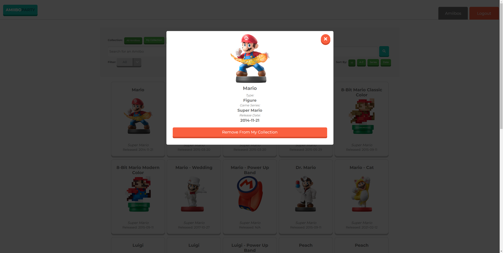

# Amiibo Party
Tracking all your amiibo's has never been so easy! Track, collect, wishlist all your current and upcoming amiibos. All kept in one place.

### The What?
Amiibo Party is an amiibo collection app that was an idea inspired by a friend from college who loved amiibos but had no real way to keep track of all the ones he had collected and future ones he didn'text

In came Amiibo Party! The one stop shop to keep track of everything Amiibo.

### The Why?
As a college student I was looking for ways to get better at programming and this was just the project idea I needed. It solved a real world problem and let me put my web developer skills to the test.

### The Tools!

## Screenshots!

